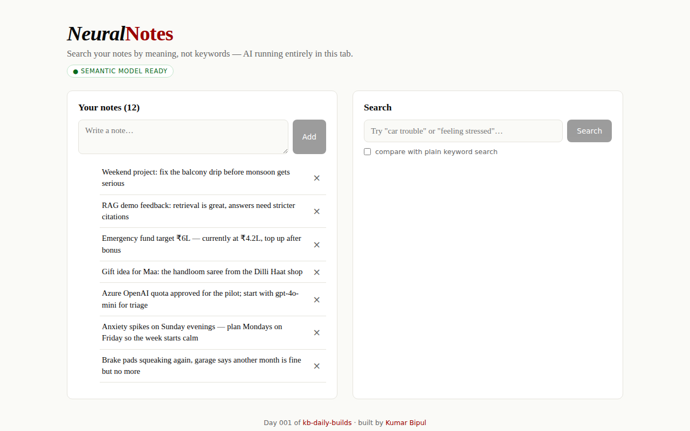

<div align="center">

# Neural Notes — AI Search That Understands Meaning

**Semantic note search running 100% in your browser — no server, no API key, your notes never leave the tab.**

[](https://github.com/kbipul/neural-notes/actions/workflows/ci.yml)
[](https://kbipul.github.io/neural-notes/)

`Day 001` of **[kb-daily-builds](https://github.com/kbipul/kb-daily-builds)** — one AI project a day.

</div>

## What it does

Search "car trouble" and it finds your note about squeaking brake pads — zero
shared words. Neural Notes embeds every note into a 384-dimensional vector
using MiniLM running *inside your browser tab* via transformers.js, then ranks
notes by cosine similarity to your query. A compare toggle shows plain keyword
search side-by-side, so you can watch semantic search win. Notes persist in
localStorage; nothing is ever sent anywhere.


<sub>*Screenshot is auto-captured by CI on every push — if it's missing, the
workflow is still running.*</sub>

## Try it

**[Live demo →](https://kbipul.github.io/neural-notes/)** — first load fetches
the ~23 MB quantized model once, then it's cached. Try `feeling stressed`,
`car trouble`, or `money planning` against the seed notes.

```bash
git clone https://github.com/kbipul/neural-notes.git
cd neural-notes
npm install
npm test        # 15 unit tests on the search core
npm run dev     # http://localhost:5173
```

## How it works

```
your note ──▶ MiniLM-L6-v2 (ONNX, WASM/WebGPU) ──▶ 384-dim vector
                                                        │
query ──▶ same model ──▶ query vector ──▶ cosine similarity ──▶ ranked results
```

Three decisions worth stealing:

1. **The model is a lazy import.** The app paints instantly; transformers.js
   and the ONNX model load in the background with progress surfaced in the UI.
   If the download fails, the app degrades to keyword search instead of dying.
2. **The search core is pure TypeScript** — no React, no model, no I/O — so
   it's fully unit-testable. The embedder hides behind a one-method interface;
   tests use vectors directly.
3. **Vectors are never persisted.** localStorage keeps only text (tiny,
   private); embeddings are recomputed on load. Model versions can change —
   stale vectors are a silent-corruption bug waiting to happen.

## Build notes — what I learned

Quantized `q8` MiniLM is a quarter of the full model's size and, for
note-search, indistinguishable in quality. The interesting failure mode was
scoring: normalized MiniLM cosine similarities cluster roughly between 0.1
and 0.8, so a raw score of 0.45 *feels* low while actually being a strong
match. Mapping `(cos+1)/2` into a visual bar keeps the UI honest without
pretending to be a percentage-match oracle.

The other lesson is architectural: putting the entire pipeline client-side
isn't just a privacy story, it deletes three operational problems — no
inference server to scale, no key to rotate, no user data to secure. For a
whole class of enterprise tools (this app is day one of a series exploring
them), "ship the model to the browser" is now a serious design option.

## Stack

| Layer | Choice |
|---|---|
| UI | React 18 + TypeScript 5 |
| Inference | transformers.js (`Xenova/all-MiniLM-L6-v2`, q8 ONNX) |
| Build / test | Vite 6, Vitest |
| Hosting | GitHub Pages (static — there is no backend) |

---

<div align="center"><sub>
Built by <a href="https://www.kumarbipul.com"><b>Kumar Bipul</b></a> ·
IT Director → AI/ML · <a href="https://github.com/kbipul">github.com/kbipul</a>
</sub></div>
