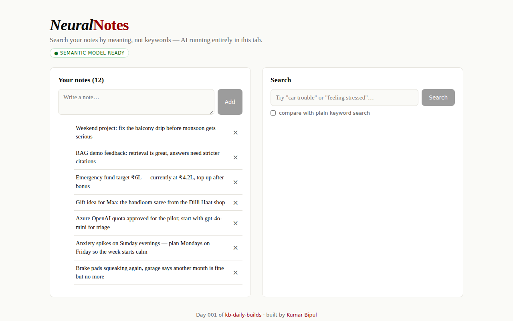

<div align="center">

# Neural Notes — AI Search That Understands Meaning

**Semantic note search running 100% in your browser. No server, no API key, your notes never leave the tab.**

[](https://github.com/kbipul/neural-notes/actions/workflows/ci.yml)
[](https://kbipul.github.io/neural-notes/)

`Day 001` of **[kb-daily-builds](https://github.com/kbipul/kb-daily-builds)**, one AI project a day.

</div>

## What it does

Search for "car trouble" and it finds your note about squeaking brake pads, even though the two share no words. Neural Notes embeds each note into a 384-dimension vector with MiniLM (running in the browser tab via transformers.js) and ranks notes by cosine similarity to your query. There's a toggle that shows plain keyword search next to the semantic results so you can compare the two directly. Notes are kept in localStorage; nothing is sent anywhere.


<sub>The screenshot is captured by CI on push. If it's missing here, the workflow probably hasn't finished yet.</sub>

## Try it

**[Live demo →](https://kbipul.github.io/neural-notes/)**. The first load pulls the ~23 MB quantized model once and caches it after that. Try `feeling stressed`, `car trouble`, or `money planning` against the seed notes.

```bash
git clone https://github.com/kbipul/neural-notes.git
cd neural-notes
npm install
npm test        # 15 unit tests on the search core
npm run dev     # http://localhost:5173
```

## How it works

```
your note ──▶ MiniLM-L6-v2 (ONNX, WASM/WebGPU) ──▶ 384-dim vector
                                                        │
query ──▶ same model ──▶ query vector ──▶ cosine similarity ──▶ ranked results
```

That diagram is three files. `src/lib/embedder.ts` puts transformers.js behind an `Embedder` interface with one method, `embed(texts)`. `src/lib/search.ts` holds the ranking: `cosineSimilarity`, `rankBySimilarity`, `rankByKeywords`, and a `NoteStore` class. `src/App.tsx` wires them together and owns the UI state.

The transformers.js import inside `TransformersEmbedder.load()` is dynamic, so the app paints before the model exists. Download progress goes through a `progress_callback` into the status chip in the header. If the load throws, `App.tsx` flips to a `fallback` state and searches route to `rankByKeywords` instead of breaking.

Nothing in `search.ts` imports React, loads a model, or touches the network. That is the whole reason the 15 tests in `src/lib/__tests__/search.test.ts` can hand `rankBySimilarity` a literal `Float32Array` and swap `window.localStorage` for a small in-memory `KV`. `Note` also carries a `seq` counter that `NoteStore.all()` sorts on, so two notes added in the same millisecond still come back newest-first.

Vectors never reach disk. `NoteStore.persist()` strips the `vector` field before writing, so localStorage holds the note text and nothing else, and embeddings are recomputed on every load. Model versions change, and stale vectors on disk are the kind of silent-corruption bug you don't notice until it's a problem.

## Build notes

Quantized `q8` MiniLM is about a quarter the size of the full model and, for note search, I couldn't tell the difference in quality. The part that tripped me up was scoring. Normalized MiniLM cosine similarities mostly land between 0.1 and 0.8, so a raw 0.45 looks weak on screen when it's actually a solid match. `rankBySimilarity` maps `(cos+1)/2` onto a bar, which keeps the display honest without pretending it's a percentage match.

Moving the pipeline into the browser is a privacy angle. It also removes operational work: no inference server to scale, no key to rotate. There is no user data on my side either, since notes live in the visitor's localStorage. For a lot of internal tooling (this is day one of a series poking at exactly that), shipping the model to the browser is a real option worth considering. GitHub Pages serves the whole app as static files.

## What I don't know yet

`App.tsx` embeds every note in a single `embed()` call when the component mounts. With the 12 seed notes in `src/lib/seed.ts` that finishes fast enough that I never noticed it. I have not run it against 500 notes, or 5,000, and I don't know where the first paint stops feeling instant.

`rankBySimilarity` returns the top 8 by score with no threshold, and mapping `(cos+1)/2` puts an unrelated note near 50 rather than near 0. Search for something you never wrote about and you still get eight results with bars that look plausible. `rankByKeywords` at least drops anything scoring 0. I don't have a similarity cutoff I trust yet.

The comparison toggle may also be flattering the semantic side. `rankByKeywords` is deliberately simple: token-set overlap scored as `hits / qTokens.size`, single-character tokens thrown away, no stemming, no TF-IDF. It's a floor, not a tuned baseline, and I'd expect a real BM25 to close part of the gap the toggle shows. I haven't measured how much.

There's a third thing I keep coming back to. Each note is mean-pooled into one 384-dim vector, so a long note covering two subjects lands as a single point. The seed notes are all one or two lines, so the demo never puts pressure on that.

## Stack

| Layer | Choice |
|---|---|
| UI | React 18 + TypeScript 5 |
| Inference | transformers.js (`Xenova/all-MiniLM-L6-v2`, q8 ONNX) |
| Build / test | Vite 6, Vitest |
| Hosting | GitHub Pages (static, no backend) |

---

<div align="center"><sub>
Built by <a href="https://www.kumarbipul.com"><b>Kumar Bipul</b></a> ·
IT Director → AI/ML · <a href="https://github.com/kbipul">github.com/kbipul</a>
</sub></div>
